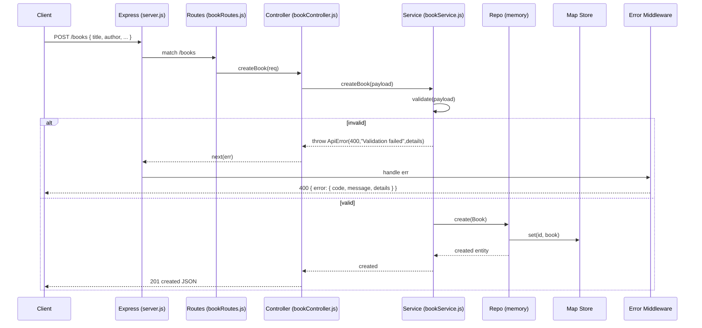

# Architecture Diagram

```mermaid
sequenceDiagram
    participant Client
    participant Express as Express (server.js)
    participant Routes as Routes (bookRoutes.js)
    participant Ctrl as Controller (bookController.js)
    participant Svc as Service (bookService.js)
    participant Repo as Repo (memory)
    participant Store as Map Store
    participant ErrMW as Error Middleware

    Client->>Express: POST /books { title, author, ... }
    Express->>Routes: match /books
    Routes->>Ctrl: createBook(req)
    Ctrl->>Svc: createBook(payload)
    Svc->>Svc: validate(payload)

    alt invalid
        Svc-->>Ctrl: throw ApiError(400,"Validation failed",details)
        Ctrl-->>Express: next(err)
        Express->>ErrMW: handle err
        ErrMW-->>Client: 400 { error: { code, message, details } }
    else valid
        Svc->>Repo: create(Book)
        Repo->>Store: set(id, book)
        Repo-->>Svc: created entity
        Svc-->>Ctrl: created
        Ctrl-->>Client: 201 created JSON
    end
```
